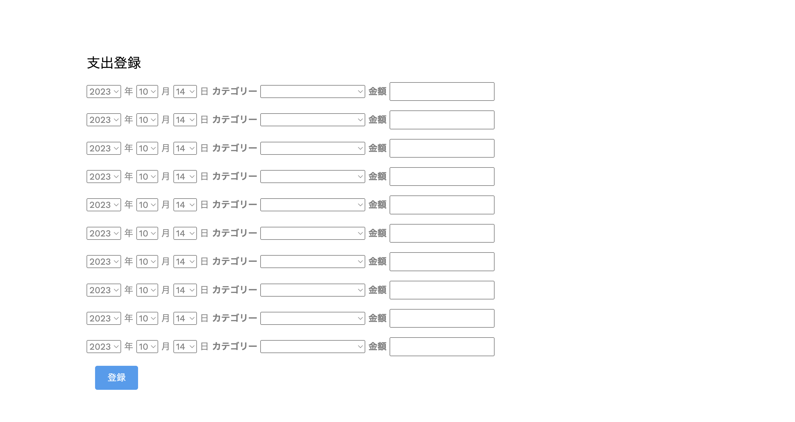
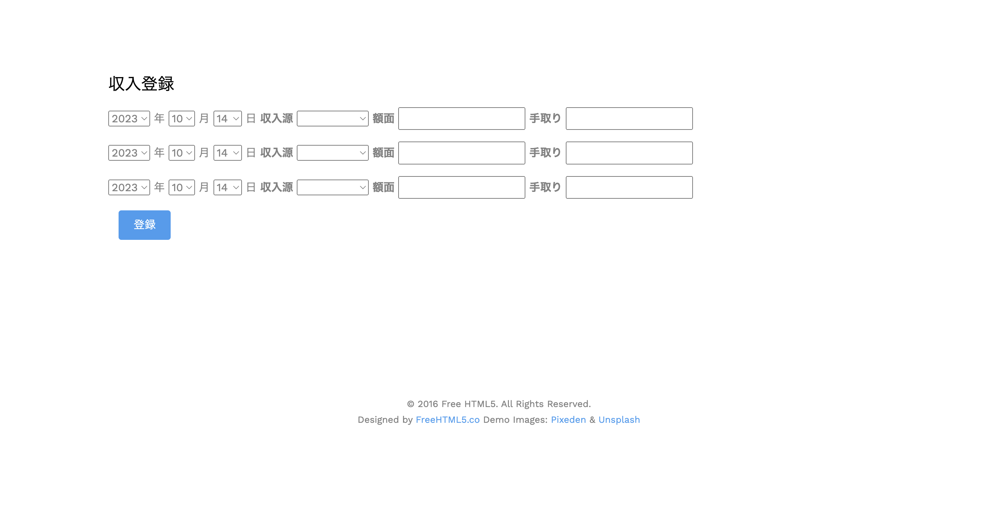
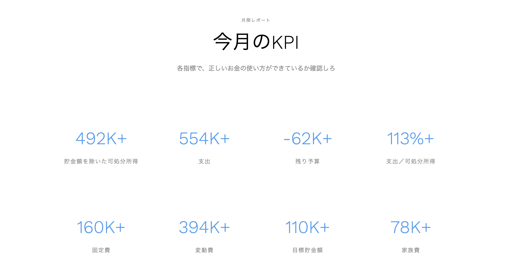

# ケロマツの家計簿

独自の家計簿Webアプリ。自らの購買行動、家計管理を分析するために作った。

# デモ

※数値は仮






# Usage

```bash
python src/app.py
```

# Status
開発中

# development
|開発内容|Status|
|---|---|
|毎月のKPI|完了|
|カテゴリ毎の支出の棒グラフ|完了|
|月の日毎の支出累積グラフ|完了|
|過去の月間レポートの確認機能|完了|
|貯金の登録画面|完了|
|年間レポート画面|完了|
|今後の資産形成の予測機能|開発予定|


# Author

* 作成者：谷口泰地

# License

"ケロマツの家計簿" is Confidential.